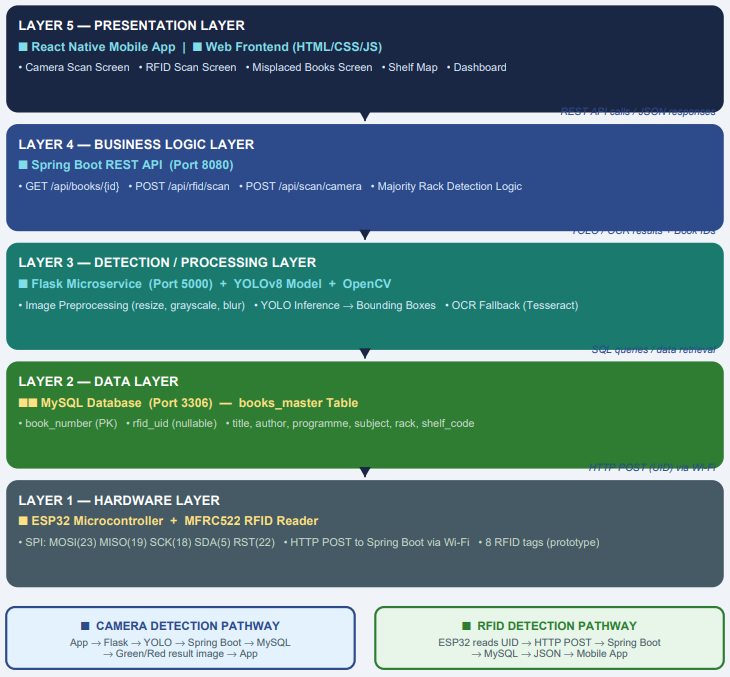
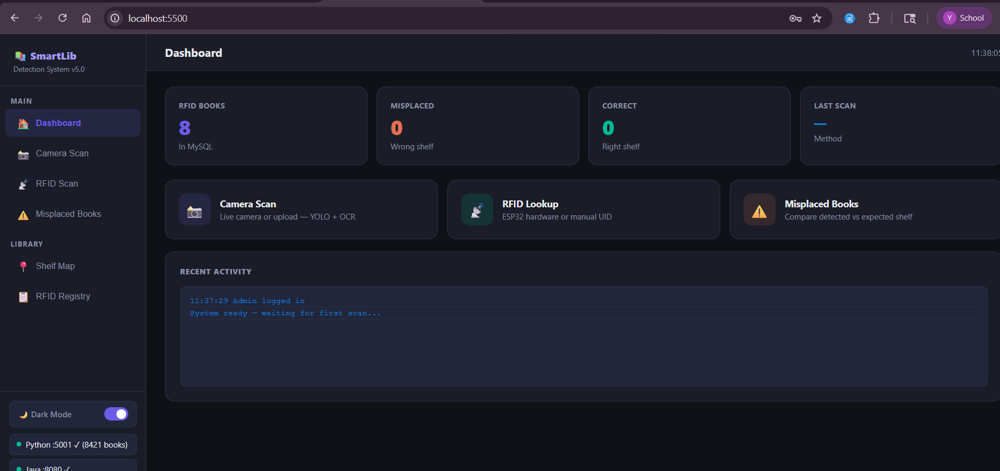
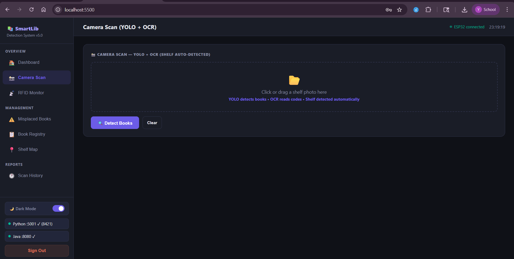
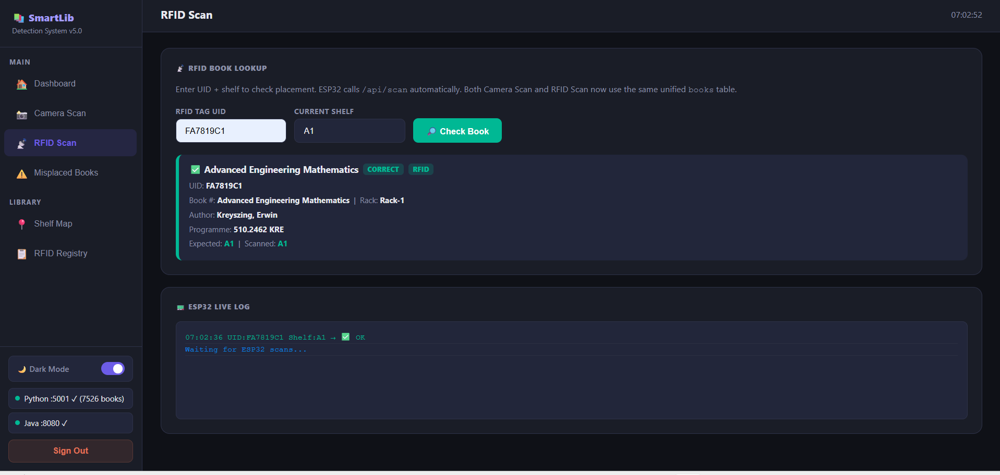
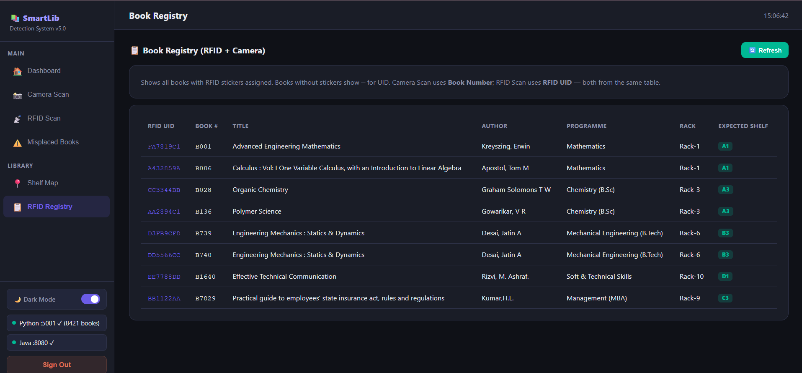

<div align="center">

# 📚 SmartLib – AI Powered Library Management System

### Intelligent Library Shelf Monitoring using **YOLOv8 • OCR • OpenCV • Spring Boot • Flask • ESP32 RFID**

[]()
[]()
[]()
[]()
[]()
[]()
[]()
[]()
[](LICENSE)

---

**An AI-powered Smart Library Management System that automates book detection, OCR-based identification, misplaced book detection, and RFID-assisted library management.**

> Developed as a multidisciplinary engineering project combining Artificial Intelligence, Computer Vision, Embedded Systems, Backend Development, and Full-Stack Web Technologies.

---

## 🎥 Demo

📹 **Demo Video**

> *(Add your YouTube or Google Drive demo link here)*

---

</div>

# 📖 Overview

Traditional library management relies heavily on manual inspection to locate books and identify misplaced items.

While barcode and RFID systems simplify identification, they still require physical interaction with each book.

**SmartLib** was designed to automate this process by combining **Computer Vision**, **Object Detection**, **Optical Character Recognition (OCR)** and **RFID** into one integrated system.

Instead of scanning every book individually, librarians can simply capture an image of an entire bookshelf.

The system automatically:

- Detects each book
- Extracts the book spine
- Reads book labels using OCR
- Matches the detected books with the library database
- Identifies misplaced books
- Supports RFID lookup for faster inventory management

---

# ✨ Key Features

### 🤖 Artificial Intelligence

- YOLOv8 Book Detection
- OCR-based Book Identification
- OpenCV Image Preprocessing
- Automatic ROI Extraction

---

### 📚 Library Management

- Book Registry
- Shelf Monitoring
- Misplaced Book Detection
- Scan History
- Search & Filtering

---

### 📡 Embedded System

- ESP32 Integration
- MFRC522 RFID Reader
- RFID Book Lookup
- Real-time Communication

---

### 💻 Web Application

- Spring Boot REST API
- Flask AI Service
- Responsive Dashboard
- Dark Theme UI

---

# 🏗 System Architecture

<p align="center">

</p>

---

# 🔄 Complete Workflow

```
Bookshelf Image
        │
        ▼
YOLOv8 Object Detection
        │
        ▼
Book Spine Extraction
        │
        ▼
OpenCV Preprocessing
        │
        ▼
OCR Recognition
        │
        ▼
Book Number Extraction
        │
        ▼
Flask AI Service
        │
        ▼
Spring Boot REST API
        │
        ▼
MySQL Database
        │
        ▼
Shelf Validation
        │
        ▼
Misplaced Book Detection
```

---

# 🚀 Development Journey

This project evolved through multiple iterations.

## Phase 1 — OCR Only

Initially, we attempted to recognize books using OCR alone.

Problems encountered:

- Different font styles
- Low image quality
- Blurry labels
- Reflections
- Partial text visibility
- Similar-looking book spines

Result:

❌ Recognition accuracy was inconsistent.

---

## Phase 2 — YOLO Integration

To improve reliability, we introduced a custom-trained **YOLOv8 model**.

Instead of applying OCR directly to the whole image, YOLO first detects each individual book spine.

Benefits:

- Better localization
- Reduced OCR noise
- Faster processing
- Higher recognition accuracy

---

## Phase 3 — Image Preprocessing

Each detected book region is processed using OpenCV.

Techniques include:

- Grayscale conversion
- Thresholding
- Noise reduction
- ROI extraction

These steps significantly improved OCR performance.

---

## Phase 4 — Backend Integration

The AI pipeline was integrated with:

- Flask
- Spring Boot
- MySQL

This enabled:

- Database lookup
- Shelf validation
- History tracking
- REST API communication

---

## Phase 5 — RFID Support

Finally, we integrated an ESP32 with an MFRC522 RFID reader.

This allows books to be identified either through:

- Camera Detection

or

- RFID Scanning

making the system more practical for real-world library environments.

---

# 💡 Why YOLO Instead of OCR Alone?

One of the biggest lessons during development was realizing that **OCR alone is not sufficient for bookshelf analysis**.

OCR works well only when text is:

- Clearly visible
- Properly aligned
- High resolution
- Free from reflections

Real library shelves rarely satisfy these conditions.

YOLO solves this problem by first detecting the exact location of every book.

Each detected region is then processed independently, allowing OCR to focus only on the relevant book spine.

This combination significantly improves recognition reliability compared to OCR-only approaches.

---

# 🛠 Technology Stack

| Category | Technologies |
|-----------|-------------|
| AI | YOLOv8, OpenCV, OCR |
| Backend | Spring Boot, Flask |
| Frontend | HTML, CSS, JavaScript |
| Database | MySQL |
| Embedded | ESP32, MFRC522 RFID |
| Languages | Python, Java, SQL, JavaScript |

---

# 📷 Screenshots

## Dashboard



---

## Camera Scan



---

## Detection Results


---

## RFID Scanner



---

## Book Registry



---

# 📂 Project Structure

```
SmartLib-AI-Library-Management/

backend/
frontend/
python-ocr-service/
esp32-rfid/
mobile-app/
database/
docs/
screenshots/

README.md
LICENSE
```

---

# ⚙ Installation

## Clone Repository

```bash
git clone https://github.com/YOUR_USERNAME/SmartLib-AI-Library-Management.git
```

---

## Backend

```bash
cd backend

mvn spring-boot:run
```

---

## AI Service

```bash
cd python-ocr-service

pip install -r requirements.txt

python app.py
```

---

## Database

Import

```
database/setup_database.sql
```

into MySQL.

Update your database credentials in the backend configuration if necessary.

---

## Frontend

Launch the frontend using your preferred local web server or open the entry page according to your project's setup.

---

# ⚠ Engineering Challenges

Building SmartLib involved much more than training an AI model.

Some of the major challenges included:

- OCR failures caused by inconsistent lighting
- Detecting partially visible book spines
- Similar book colors and layouts
- Synchronizing Python, Java, and MySQL services
- Integrating embedded hardware with the backend
- Optimizing communication between YOLO, OCR, and REST APIs
- Handling real-world edge cases during shelf scanning

Most development time was spent debugging, refining the pipeline, and integrating multiple technologies into one reliable system.

---

# 📈 Future Improvements

- Cloud Deployment
- Docker Support
- Mobile Application Expansion
- CCTV Live Shelf Monitoring
- Automated Email Notifications
- Multi-Library Support
- Higher Accuracy Detection Models
- Performance Optimization

---

# 📚 Lessons Learned

This project reinforced several important engineering principles:

- AI systems require strong software engineering practices.
- Data quality often matters more than model complexity.
- Object Detection and OCR complement each other effectively.
- Hardware and software integration introduces unique real-world challenges.
- Team collaboration is essential for multidisciplinary projects.
- Debugging and system integration often consume more time than model training.

Perhaps the biggest takeaway was that building a reliable AI application is not just about achieving high model accuracy—it is about designing a complete, maintainable, and integrated system.

---

# 👨‍💻 Contributors

| Team Member | Contribution |
|--------------|-------------|
| **Yug Patel** | YOLO model development, ESP32, RFID integration, AI pipeline, system debugging |
| **Rahi** | OCR pipeline, Flask backend, OpenCV preprocessing, backend integration |
| **Yashvi** | UI/UX design, project documentation, reports, knowledge product |
| **Harsh** | Database design and management |

---

# 🙏 Acknowledgements

This project was developed as a collaborative academic project with the objective of applying Artificial Intelligence and Embedded Systems to solve real-world library management challenges.

Special thanks to every team member whose contributions made this project possible.

---

# 📄 License

This project is licensed under the MIT License.

See the **LICENSE** file for more information.

---

<div align="center">

### ⭐ If you found this project interesting, consider giving it a star!

</div>